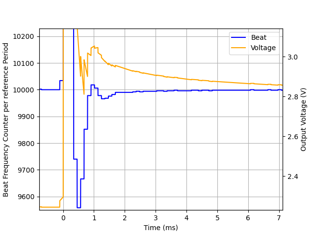
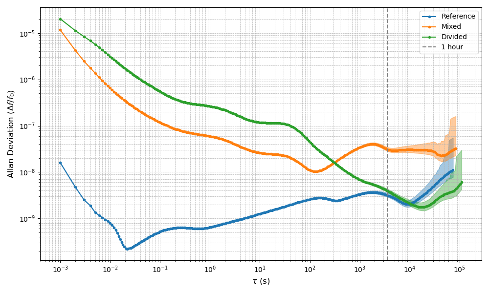
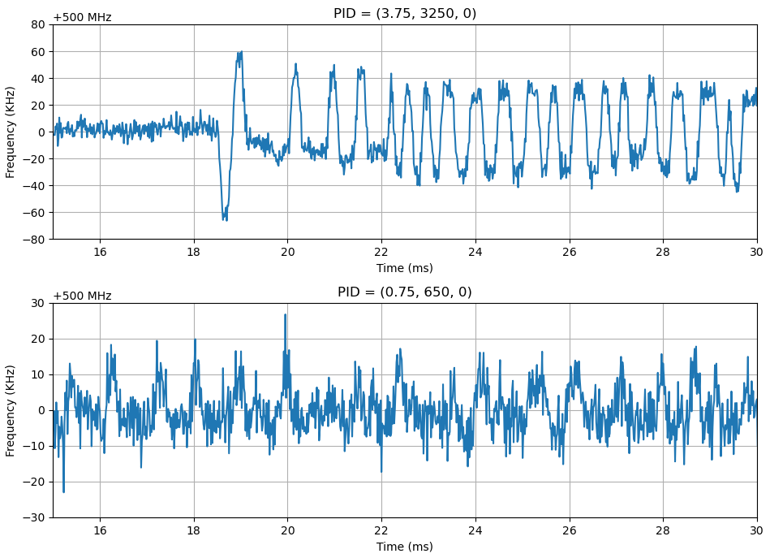

Firmware for laser offset stabilization using []

Forked from https://github.com/quartiq/stabilizer

# Description
This firmware repurposes microcontroller pins to use them as beat signal and reference clock inputs.

TIM1 (Pin PE7 / GPIO Pin 6) is a reference timer. After 1000 counts it triggers the readout of TIM8 (Pin PA0 / GPIO Pin 18). TIM8 counts the beat signal. The counted value gets fed into the IIR filter by replacing the ADC signal.

# Example Setup
A beat signal was generated from two NKT Adjustik fiber lasers at 1560 nm using a 50:50 fiber splitter, a Thorlabs FGA01FC photodiode, a Mini-Circuits ZX85-12G-S+ bias tee, and a Mini-Circuits ZX60-14LN-S+ amplifier.

The analog beat signal was digitized and divided by 6 using an AD9513 evaluation board, which was powered by the 3.3 V output of the Stabilizer.

A Sinara Urukul module produced the reference signal, and a bias tee shifted this signal to positive voltages.

One laser operated in a free-running mode, while the wavelength modulation input of the other laser was connected to the Stabilizer’s output, with modulation range set to narrow.

The reference frequency was adjusted from 10 MHz to 8.9 MHz, jumping the target beat frequency from 600 MHz to 543 MHz. In a frequency-doubled Rb87 setup, this roughly corresponds to a jump from MOT to Grey Molasses cooling frequencies.

In the graph below you can see the data stream of the stabilizer. The firmware stabilizes the divided beat signal at 10000 counts per reference period, which at 10 MHz reference is 100 MHz. At 0 ms the reference frequency was changed. 

With this setup the laser frequency step response reached 99.6% of the target frequency within 1ms. This corresponds to < 4.5 MHz difference after frequency doubling.

# Stability Measurement

The stability of the system was evaluated using a frequency counter. As before one setup used frequency division to get the beat signal down to 100MHz. A second setup instead used downconversion with a mixer. Both measurements were taken at 500 MHz beat frequency. The range of the frequency counter did not allow to directly record the 500 MHz. Instead the measurement was taken at 100 MHz. Since the signal after the frequency divider was not easily useable for the frequency counter, the beat signal was split before the divider and the signal leading to the frequency counter was also mixed down to 100 MHz.
A third measurement evaluated the stability of the reference signal and recorded 100 MHz taken straight from the Sinara Urukul.

In the graph below you can see the Allan Deviation of the recorded signals. 

It can be seen that in the long term the stability of the beat signal approaches the stability of the reference signal. Over short time intervals, the signal exhibits increased noise (see the next paragraph). Comparing the measurements is more challenging since they were taken consecutively and are also strongly influenced by the PID values. While reducing the PID values can decrease the amplitude of high-frequency noise, it also slows down the step response.

For a short term analysis the beat signal was recorded with an oscilloscope. For this the 100 MHz signal was further mixed down to 2 MHz. Afterwards a rolling sinusoidial fit was applied using a time window of 16 periods (16/2 MHz). 

The short term stability seems to be limited by the beat frequency resolution of the stabilizer. On the stabilizer stream the input signal only deviates by the minimal resolvable frequency change. With higher PID values this causes stronger output changes. By reducing the PID values the influence of the discrete input values can be reduced. The input frequency resolution is 2/10000 if locked at 100 MHz. If the setup uses a frequecy divide by 5, this translates to 100 kHz beat frequency resolution, or 20 kHz if using a mixer instead of a divider. The DAC resolution of ~0.3 mV corresponds to ~37 kHz laser modulation resolution. For the operation of a MOT this is sufficient, nevertheless the input resolution could be improved by locking at a higher frequency (see [Limitations](#Limitations)).

# Limitations

- The reference frequency is different from the update rate of the IIR filter. This causes the spikes on the output voltage signal.
- The reference frequency can only be changed in a small range, as the optimal IIR parameters depend on it. This could be improved by using an internal reference and establishing a fast communication to the stabilizer, to control the frequency setpoint instead of changing the time reference.
- The upper limit of the beat input frequency is 150 MHz. As of the STM32H743 datasheet this could be improved by using a different timer setup, but would require more firmware changes and/or exposing different pins on the PCB.

# Acknowledgment
This research was funded by the Federal Ministry for Economic Affairs and Climate Action (BMWK) due to an enactment of the German Bundestag under Grant 50NA2106 (QGyro+).