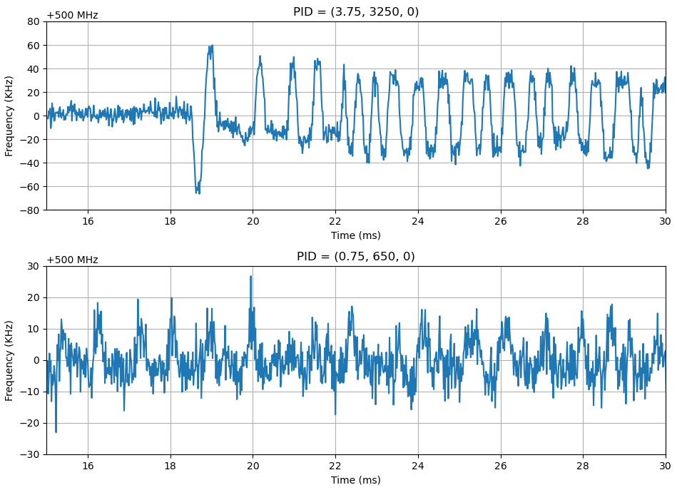

Firmware for laser offset stabilization using [Stabilizer](https://github.com/sinara-hw/Stabilizer)

Forked from https://github.com/quartiq/stabilizer

# Description
This firmware repurposes microcontroller pins to use them as beat signal inputs. Additionaly an SPI readout was implemented. All parameters available over MQTT can be changed through SPI, this includes the frequency setpoint of the PID. Timing jitter of when SPI change take effect are around ~20 µs relative to the last transmitted character.

TIM1 (Pin PE7 / GPIO Pin 6) and TIM8 (Pin PA0 / GPIO Pin 18) are two input channels that count the edges of the beat signal. TIM4 is an internal reference timer that trigges the readout of TIM1&8 after it reaches 1000 counts, driven by the clock of the microcontroller. The counted value gets fed into the IIR filter by replacing the ADC signal. 

# Example Setup
The example setup and measurements were done with a previous version of the firmware. For details see here https://github.com/PhBrb/OffsetStabilizer/tree/df51bff8c467c5fa5d0c28242ecd98a47d794ebe )

A beat signal is generated from two NKT Adjustik fiber lasers at 1560 nm using a 50:50 fiber splitter, a Thorlabs FGA01FC photodiode, a Mini-Circuits ZX85-12G-S+ bias tee, and a Mini-Circuits ZX60-14LN-S+ amplifier.

The analog beat signal is digitized and divided using an AD9513 evaluation board, which is powered by the 3.3 V output of the Stabilizer.

Short term stability is likely to not have changed from the previous firmware version.
For a short term analysis the beat signal was recorded with an oscilloscope. For this the 100 MHz signal was further mixed down to 2 MHz. Afterwards a rolling sinusoidial fit was applied using a time window of 16 periods (16/2 MHz). 

The short term stability seems to be limited by the beat frequency resolution of the Stabilizer. On the Stabilizer stream the input signal only deviates by the minimal resolvable frequency change. With higher PID values this causes stronger output changes. By reducing the PID values the influence of the discrete input values can be reduced. The input frequency resolution is 2/10000 if locked at 100 MHz. If the setup uses a frequecy divide by 5, this translates to 100 kHz beat frequency resolution, or 20 kHz if using a mixer instead of a divider. The DAC resolution of ~0.3 mV corresponds to ~37 kHz laser modulation resolution (NKT wavelength modulation range set to Narrow). For the operation of a MOT this is sufficient, nevertheless the input resolution could be improved by locking at a higher frequency (see [Limitations](#Limitations)).

The SPI data was sent from a Sinara Kasli. A divide by 6 on the SPI clock and a time between the 32 bit messages of ~80 µs gave a stable transmission.

# Limitations
- The upper limit of the beat input frequency is 150 MHz. As of the STM32H743 datasheet this could be improved by using a different timer setup, but would require more firmware changes and/or exposing different pins on the PCB. This would reverse the timer setup and require the beat timer to trigger the reference clock timer readout, which would cause the update rate of the IIR filter to depend on the beat frequency. 
- The update rate of the frequency counting is lower than the update rate of the IIR filter.

# Acknowledgment
This research was funded by the Federal Ministry for Economic Affairs and Climate Action (BMWK) due to an enactment of the German Bundestag under Grant 50NA2106 (QGyro+).